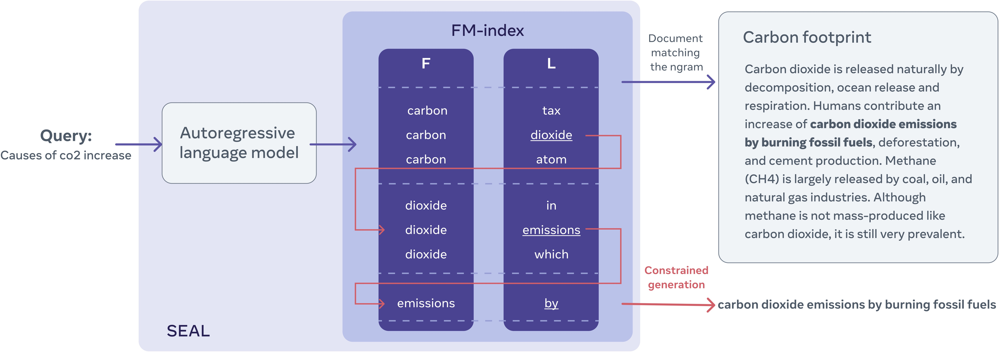

# SEAL: <u>S</u>earch <u>E</u>ngines with <u>A</u>utoregressive <u>L</u>Ms
This repo hosts the code for our paper, SEAL.
 
 ```bibtex
@inproceedings{bevilacqua2022autoregressive,
  title={Autoregressive Search Engines: Generating Substrings as Document Identifiers}, 
  author={Michele Bevilacqua and Giuseppe Ottaviano and Patrick Lewis and Wen-tau Yih and Sebastian Riedel and Fabio Petroni},
  booktitle={arXiv pre-print 2204.10628},
  url={https://arxiv.org/abs/2204.10628},
  year={2022},
}
```

[https://arxiv.org/abs/2204.10628](https://arxiv.org/abs/2204.10628)

## Changelog

**UPDATE!** (05/22/2022) [Preprocessing/training scripts](scripts/training) added!

## Introduction

We propose a approach to retrieval that uses guided LM decoding to search for occurrences of ngrams of any size in an 
arbitrary large collection of documents. Constrained decoding blocks the generation of ngrams that never appear in the corpus: generated ngrams are always grounded in one or multiple documents in the retrieval corpus. Documents are then scored by aggregating the scores for individual generated "identifiers". 

We use the Ferragina Manzini index (FM-index), an opportunistic, compressed suffix array as the unified data structure for constrained decoding, retrieval and full-text storage.



## The FM-index
You can think of the FM-index as a trie that not indexes not only a set of strings s, but the **union** of every substring 
of each string. We can perform constrained decoding of ngrams of unbounded length from any point in the retrieval corpus, 
from simple unigrams to entire sentences.

Our implementation relies on [`sdsl-lite`](https://github.com/simongog/sdsl-lite).

## Install
SEAL needs a working installation of [SWIG](https://www.swig.org/), e.g. (on Ubuntu):
```commandline
sudo apt install swig
```

We also assume that `pytorch` is already available in your environment. SEAL has been tested with version 1.11.

Clone this repo with `--recursive` so that you also include the submodule in `res/external`.
```commandline
git clone --recursive https://github.com/facebookresearch/SEAL.git
```

Compile and install `sdsl-lite`:
```commandline
env CFLAGS='-fPIC' CXXFLAGS='-fPIC' res/external/sdsl-lite/install.sh
```

Install other dependencies:
```commandline
pip install -r requirements.txt

# pyserini
# pip install -r requirements_extra.txt
```

Now install this library.
```commandline
pip install -e .
```
## Download
We make available both model checkpoints and pre-built indices for both Natural Questions and [the KILT benchmark](https://github.com/facebookresearch/KILT):
* [Natural Questions (`SEAL_NQ.tar.gz`)](http://dl.fbaipublicfiles.com/seal/SEAL_NQ.tar.gz)
* [KILT (`SEAL_KILT.tar.gz`)](http://dl.fbaipublicfiles.com/seal/SEAL_KILT.tar.gz)

## Retrieval
### Command-line interface
To run prediction, launch the following command:

```commandline
TOKENIZERS_PARALLELISM=false python -m seal.search \
    --topics_format dpr --topics input.json \
    --output_format dpr --output output.json \
    --checkpoint checkpoint.pt \
    --fm_index fm_index \
    --jobs 75 --progress --device cuda:0 --batch_size 20 \
    --beam 15
```
The script will generate the DPR prediction file `output.json`. The `kilt` format is also supported.

### The `Searcher` class
Our codebase relies on a `pyserini`-like searcher class, that incapsulates both constrained decoding and retrieval. You
can use it programmatically:
```python
from seal import SEALSearcher

searcher = SEALSearcher.load('fm_index', 'checkpoint.pt')
searcher.include_keys = True

query = "can you eat soup with a fork"

for i, doc in enumerate(searcher.search(query, k=3)):
    print(i, doc.score, doc.docid, *doc.text(), sep='\t')
    print("Matched:")
    matched = sorted(doc.keys, reverse=True, key=lambda x:x[2])
    matched = matched[:5]
    for ngram, freq, score in matched:
        print("{:.1f}".format(score).zfill(5), freq, repr(ngram), sep='\t')

# 0	375.03041350768547	13796077	Chopsticks	are similar, finer points can differ from region to region. 
# In Cambodia, a fork and spoon are the typical utensils used in Cambodian dining and etiquette. Spoons are 
# used to scoop up food or water and the fork is there to help guide the food onto the spoon. Chopsticks 
# are normally used in noodle dishes such as the Kuy Tiev and soup dishes. When eating soup the chopsticks 
# will typically be paired with the spoon, where the chopsticks will pick up the food and the spoon will be 
# used to drink the broth. Forks are never to touch the mouth,
# Matched:
# 161.3	10	' eating soup'
# 059.5	9390	' fork'
# ...
```

## Constrained decoding

### Building the FM-index (CLI)
To most straightforward way to build the FM-index is to use the script we have provided in `scripts/build_fm_index.py`! 
You only need  to put your retrieval corpus in a very simple TSV format as in the following example:
```
doc1    Doc 1   This is a sample document
doc2    Doc 2   This is another sample document
doc3    Doc 3   And here you find the final one
```
Fields are: 
* document id
* document title
* text 

Then you can build the FM-index with:
```commandline
FILE_I=res/sample/sample_corpus.tsv
FILE_O=res/sample/sample_corpus.fm_index

python scripts/data/build_fm_index.py \
    $FILE_I $FILE_O \
    --hf_model facebook/bart-large  \
    --jobs 40 --include_title \
```
The parameter `--jobs` only speeds up the tokenization at the moment. `--include_title` only makes sense if your retrieval corpus has non-empty titles.

### Building the FM-index (Python)
```python
from seal import FMIndex
from transformers import AutoTokenizer

corpus = [
    "Doc 1 @@ This is a sample document",
    "Doc 2 @@ This is another sample document",
    "Doc 3 @@ And here you find the final one",
]
labels = ['doc1', 'doc2', 'doc3']

tokenizer = AutoTokenizer.from_pretrained('facebook/bart-large')
def preprocess(doc):
    doc = ' ' + doc
    doc = tokenizer(doc, add_special_tokens=False)['input_ids']
    doc += [tokenizer.eos_token_id]
    return doc

corpus_tokenized = [preprocess(doc) for doc in corpus]

index = FMIndex()
index.initialize(corpus_tokenized, in_memory=True)
index.labels = labels

index.save('res/sample/sample_corpus.fm_index')
# writes res/sample/sample_corpus.fm_index.fmi
# writes res/sample/sample_corpus.fm_index.oth

index = FMIndex.load('res/sample/sample_corpus.fm_index')
```
Check out `seal/fm_index.py`! 

### Decoding with the FM-index
You can easily plug in our constrained decoding code in your project by using the `fm_index_generate` function. In the 
following snippet we show a use case beyond retrieval: paraphrase mining.
```python
from transformers import AutoTokenizer, AutoModelForSeq2SeqLM
from seal import fm_index_generate, FMIndex

tokenizer = AutoTokenizer.from_pretrained('tuner007/pegasus_paraphrase')
model = AutoModelForSeq2SeqLM.from_pretrained('tuner007/pegasus_paraphrase')

# building the corpus from a single long string
corpus = " ".join("""
They also were found to have perfectly coiffed hair, and wore what appeared to be Dior makeup. 
“We were shocked to discover the unicorns,” said anthropologist Daniel St. Maurice. “They were 
like nothing we had ever seen before. We had heard legends of the unicorns, but never thought 
they actually existed.” When the scientists first arrived in the valley, the unicorns were 
surprised and startled by the presence of humans, but were also excited. The unicorns welcomed 
the researchers and explained that they had been waiting for them for a very long time. “The 
unicorns said that they had been waiting for us for a very long time,” said Dr. St. Maurice. 
“They said they had always known that humans would eventually discover them, but that they had 
also always known that humans would be too stupid to realize the unicorns had been waiting for 
them.”
""".split()).strip()
corpus = tokenizer(' ' + corpus, add_special_tokens=False)['input_ids'] + [tokenizer.eos_token_id]
index = FMIndex()
index.initialize([corpus], in_memory=True)

# constrained generation
query = " ".join("""
The unicorns greeted the scientists, explaining that they had been expecting the encounter for
a while.'
”""".split()).strip()
out = fm_index_generate(
    model, index,
    **tokenizer([' ' + query], return_tensors='pt'),
    keep_history=False,
    transformers_output=True,
    always_allow_eos=True,
    max_length=100,
)
print(tokenizer.decode(out[0], skip_special_tokens=True).strip())
# unicorns welcomed the researchers and explained that they had been waiting for them for a very long time.

```


## Licence
SEAL is licensed under the CC-BY-NC 4.0 license. The text of the license can be found [here](LICENSE).


